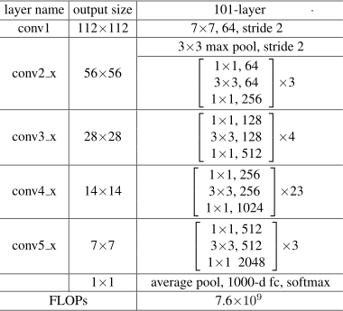
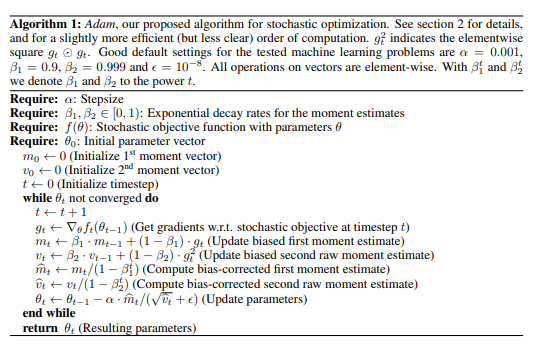
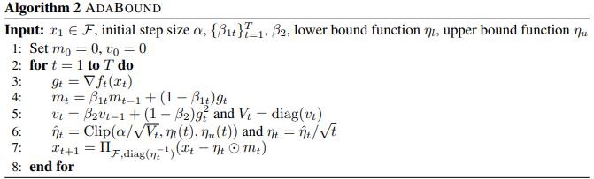
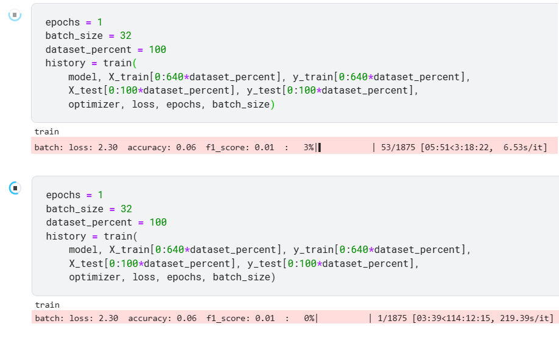
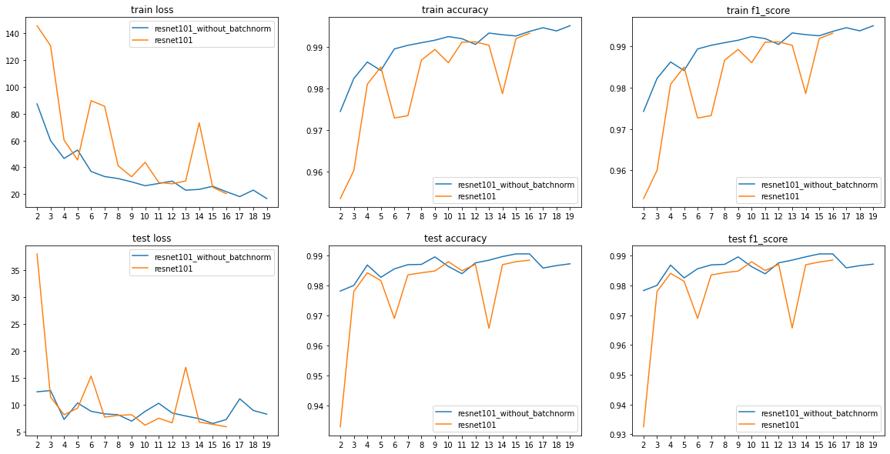
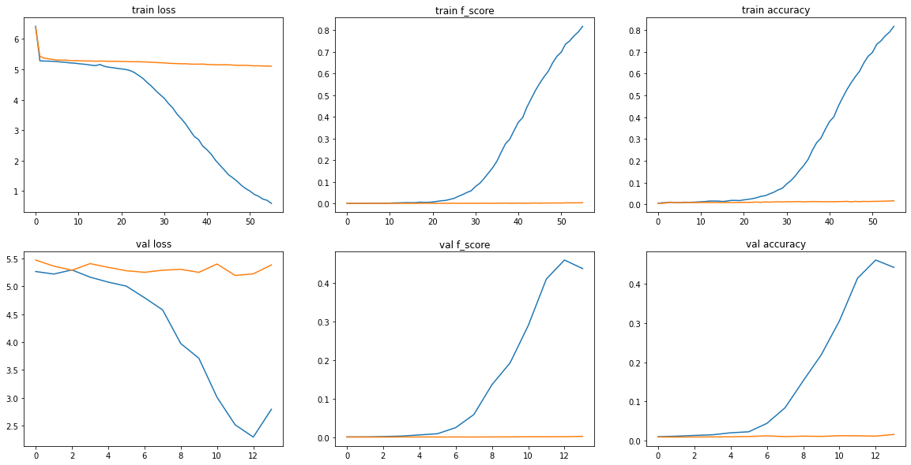
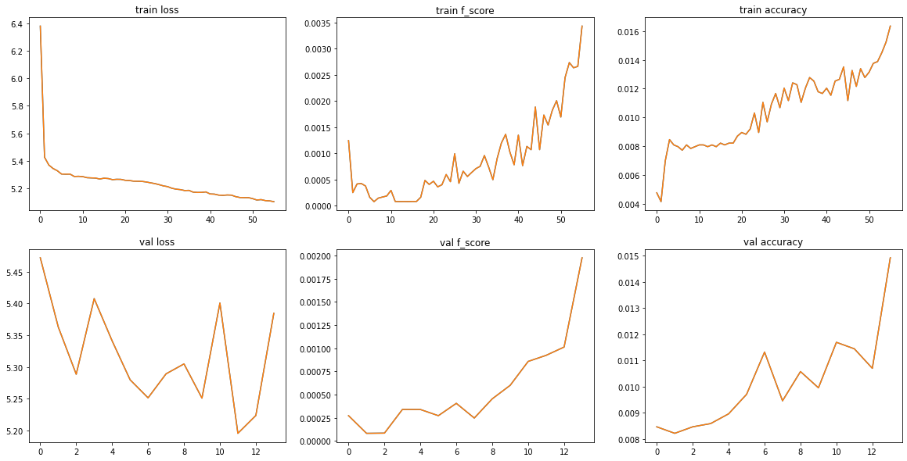
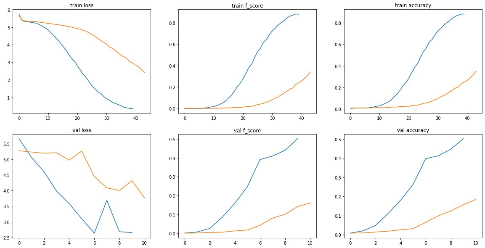

# ResNet-101 numpy

**Ветка adabound-and-batchnorm, в которой ведется работа над добавлением batchnorm в resnet, a также провеены эксперименты, сравнивающие adabound и adam на примере задачи Stanford cars**

ResNet-101 на numpy без других библиотек и апробация на MNIST

Также была реализована ResNet-101 на torch. Обучение pytorch имплементации произведено на датасете [Stanford Cars](http://ai.stanford.edu/~jkrause/cars/car_dataset.html). При этом использовались два оптимизатора Adam и [Adabound](https://arxiv.org/abs/1902.09843v1) с целью их сравнения.

## Содержимое корня репозитория
* Jupyter notebooks
    * [numpy_resnet_mnist.ipynb](./numpy_resnet_mnist.ipynb) - обучение [numpy реализации](./numpy_nn/models/resnet.py) resnet-101 на датасете MNIST с использованием оптимизатора Adam
    * [torch_resnet_cars_adam_vs_adabound.ipynb](./torch_resnet_cars_adam_vs_adabound.ipynb) - обучение [pytorch реализации](./pytorch_nn/models/resnet.py) resnet-101 на датасете [Stanford Cars](http://ai.stanford.edu/~jkrause/cars/car_dataset.html). Сравнение сходимости при использовании Adam и [Adabound](https://arxiv.org/abs/1902.09843v1)
    * [official_torch_resnet_adam_vs_adabound.ipynb](./official_torch_resnet_adam_vs_adabound.ipynb) - аналогичен [torch_resnet_cars_adam_vs_adabound.ipynb](./torch_resnet_cars_adam_vs_adabound.ipynb), но обучается оффициальная имплементация resnet-101 из torchvision
* Python packages, исплементиррованные в рамках проекта:
    * [numpy_nn](./numpy_nn) - реализация с использованием только numpy resnet101, всех слоев, необходимых для создания данной модели, а также оптимизаторов и CE Loss. Тестиорваие всего перечисленного
    * [pytorch_nn](./pytorch_nn) - реализация resnet101 на pytorch. Также здесь лежит единственный модуль, написанный не мной - оффициальная реализация оптимизатора AdaBound
* Другое:
    * [utils](./utils) - код, полезный для всех jupyter блокнотов проекта. Например, вывод графиков с историей обучения

Директории [numpy_nn](./numpy_nn) и [pytorch_nn](./pytorch_nn) следует воспринимать как библиотеки, внутри которых не должно быть исполняемого кода

## Теоретическая база
### ResNet-101

### Adam

### AdaBound

<!--
ResNet-101 включает в себя свертку conv1, макс пулинг и далее множество коллекций слоев convi. convi_x является bottleneck'ом. Bottlencek состоит из трех сверток: 1x1, 3x3, 1x1. Первая свертка понижает число выходных каналов, последняя повышает.
Помимо сверток Bottleneck имеет identity mapping (точная копия входа Bottleneck'а), который складывается с выходом последней свертки Bottleneck'а. В случае, когда число каналов identity mapping'a не совападает с числом каналов выхода последней свертки, перед складыванием с conv3 над identity mapping'ом производится свертка 1x1, приводящая его к необходимой размерности.

В conv1 размерность плоскости входного тензора уменьшается вдвое в связи с тем, что stride = 2. Перед conv2_1 производится даунсемплинг карты признаков (feature map) в 2 раза с помощью max pooling'а. Далее conv3_1, conv_4_1 и conv5_1 первая свертка bottleneck'а имеет stride = 2. Таким образом, ширина и высота сходного "изображения" сужаются в 32 раза перед тем как дойти до average pooling, который оставляет одно значение для каждого канала. Такой пулинг позволяет использовать входные данные произвольной размерности. Тем не менее, в связи с понижением размерности при проходе через сеть вход должен быть не менее 32 и, желательно, кратен 32 (иначе тензоры будут "обрезаться").
-->

## Реализация resnet-101 на numpy (содержимое numpy_nn) и обучение 

### Базовые слои
Базовые модули сврточной нейронной сети, оптимизаторы и функция потерь реализованы в директории [./numpy_nn/modules](./numpy_nn/modules).

Реализованы классы:
* FullyConnectedLayer
* Conv2d — реализация свертки с помощью матричного умножения. Подробнее в [./numpy_nn/modules/README.md](./numpy_nn/modules/README.md).
* Conv2dWithLoops — имплементация свертки на циклах.
* MaxPool2d
* Flatten
* ReLULayer
* SigmoidLayer
* CrossEntropyLossWithSoftMax
* AdamOptimizer
* GradientDescentOptimizer
* Sequential
* BatchNormalization2d

Реализация свертки, основанной на матричном умножении, привела к **более чем 34-ех кратному ускорению обучения** resnet101 на MNIST! На скриншоте ниже видно, что ранее одна эпоха треборвала более 114 часов, теперь около 3 часов.

В моей реализации оптимизаторы получают на вход список слоёв. Это необходимо, потому что на данный момент, чтобы получить актуальные частные производные функции потрерь по параметрам, нужно их запросить у слоя, так как они изменяются не inplace. Каждый модуль нейронной сети (дочерние классы класса Layer, а также классы реализующие части нейронной сети или нейронную сеть целиком) имеют метод get_trainable_layers, возвращающий все обучаемые слои, входящие в состав модуля. Выход данного метода подется на вход конструктору оптимизатора. В ветке [optimizers_take_parameters](https://github.com/proshian/DNN_course_ITMO_2022/tree/optimizers_take_parameters) ведется работа, чтобы оптимизаторы принимали параметры, а слои были переписаны так, чтобы частные производные всегда были одними и теми же numpy матрицами, которые меняются inplace.

### ResNet-101 
В модуле [numpy_nn/models/resnet.py](./numpy_nn/models/resnet.py) реализация resnet-101 на numpy. Там находятся:
* реалиация `Bottleneck` residual block'а
* класс `ResNet`, который собирает архитектуру получая на вход список количеств residual ботлнеков каждой конфигурации 
* Функция `resnet101` вызывающая конструктор класса `ResNet` с количествами ботлнеков: [3, 4, 23, 3]

Также в директории [numpy_nn/models](./numpy_nn/models/) присутствует реализация [resnet101 без батч-нормализации](./numpy_nn/models/resnet_without_batchnorm.py)

### Тестирование
Директория [numpy_nn/test](./numpy_nn/test/) посвящена тестированию классов, реализующих модули нейронной сети на numpy.

Для тестирования используются аналогичные классы на pytorch. Если тестируется обучаемый модуль, обе реализации инициализируются одинаковыми весами. В качетве входных данных и частной производной функции потерь по выходу модуля генерируются тезоры случайных чисел. Производится forward и backward проходы и Сравниваются выходы, а также частные производные функции потерь по весам, смещениям (bias) и входным данным.

Алгоритм, описанный выше реализован в методе test_module, python модуля [test_layer.py](./numpy_nn/test/test_layer.py). Он вызывается внутри всех методов, тестирующих модели нейронных сетей. Тесты производились в [module_tests.ipynb](./numpy_nn/test/module_tests.ipynb)

Все базовые модули нейронной сети, кроме батчевой нормализации, имеют результаты (под результатами понимаются чатсные производные по всем параметрам и выходные данные), совпадающие с pytorch до 6 знаков после запятой. Результаты батчевой нормализации свпадают до 4 знаков после запятой.

Выходные данные и частная производня функции потерь по входным данным resnet101_without_batchnorm совпадают с аналогом на pytorch до 6 знаков после запятой.

У resnet выходные данные совпадают до 2 знаков после запятой, а частная производня функции потерь по входным данным совпадает до 2 знаков до запятой. Однако, большинство  

### Обучение

В [./numpy_resnet_mnist.ipynb](./numpy_resnet_mnist.ipynb) произведено обучение на датасете MNIST моей реализации resnet-101 на numpy. Также в этом файле предоставлен код для определения и обучения небольшой сверточной нейронной сети, чтобы продемонстрировать, как пользоваться реализованными класами.

Результаты обучения resnet на numpy на графиках ниже. Как видно, без батч-нормализации работает стабильнее, что ожидаемо, ведь судя по тестам, мой numpy resnet без батчнормализации работает в точности как аналогичный resnet на pytorch, а с батчнормализацией результаты отличаются. 

## Реализация resnet-101 на torch и сравнение обучения с использованием Adam и AdaBound
### Описание разработанной системы (алгоритмы, принципы работы, архитектура)
Весь код находится в директории [./pytorch_nn](./pytorch_nn).

В [./pytorch_nn/models/resnet.py](./pytorch_nn/models/resnet.py) Находится моя имплементация resnet на pytorch. Классы аналогичны описанным выше для numpy.

В [./resnet-adam-vs-adabound.ipynb](./resnet-adam-vs-adabound.ipynb) сравнивается обучение на датасете [Stanford Cars](http://ai.stanford.edu/~jkrause/cars/car_dataset.html) моей и оффициальной имплементаций resnet101 с оптимизаторами Adam и AdaBound.

Чтобы сравнение было честным и воспроизводимым перед обучением моей имплементации модели инициализировались одинаковыми весами. К сожалению, аналогичного действия по отношению к официальной имплементации не было произведено.

Из исходных изображений оставляется только участок, содержащий машину. Затем производится преобразование к одноканальному изображению в оттенках серого и сжатие до 96x96. 

### Результаты работы и тестирования системы (скриншоты, изображения, графики, закономерности)

*Все графики обучкения более гладцие, так как валидация производилась в 4 раза реже обучения*

Ниже результаты обучения моей имплементации resnet101 на torch c Adam (синий) и с AdaBound (оранжевый) learning rate = 0.005.

Ниже отдельно результаты обучения моей имплементации resnet101 на torch c  AdaBound.

Ниже результаты обучения оффициальной имплементации resnet101 на torch c Adam (синий) и с AdaBound (оранжевый) learning rate = 0.001.

Ниже результаты обучения моей имплементации resnet101 *до того, как была добавлена батч-нормализация* на torch c Adam (синий) и с AdaBound (оранжевый) learning rate = 0.002.

## Выводы по работе

Очевидно, работать с моделями, используя фреймворки удобнее, так как они высокооптимизированы и поддерживают cuda.

Исползование реализации свертки в виде матричного умножения делает скорость обратного распространения значительно быстрее продемонстрировано в конце [./numpy_nn/test/module_tests.ipynb](./numpy_nn/test/module_tests.ipynb). Например, при параметрах n_input_channels = 4,n_output_channels = 2, width = 3, height = 5, kernel_size = 3, stride = 1, padding = 3 и batchsize = 8 1000 итераций обратного распространения на pytorch занимают 1.2 секунды, при матричной имлементации свертки - 4.2 секунды, а на циклах - 20.7 секунды.

Изначально моя имплементцаия resnet-101 не содержала батч-нормализацию. Ее использование ускорило обучение 

При обучении моей имплементации c Adabound функция потерь падает невероятно медленно и по сравненю с Adam выглядит как прямая линия.

Обучение официально имлементации resnet101 тоже было медленне с AdaBound.

В данном эксперименте не было выявлено заявленных преимуществ AdaBound.

## Использованные источники
1. [Adabound](https://arxiv.org/abs/1902.09843v1)
2. [Adam](https://arxiv.org/abs/1412.6980)
3. [ResNet](https://arxiv.org/pdf/1512.03385.pdf)

# TODO

* Получить батчнормализацию, которая будет проходить тесты с точностью 1e-6

* add loss test funciton
* Check if test_stack_of_layers works

* Update the readme
    * translate README to English
    * добавить раздел поясняющий как устроены тесты

* Мб добавить в скрипты проверку, есть ли необходимые модули в sys.path, если нет, сделать добавление

* Когда батч-нормализация будет починена, удалить варианты resnet без батч-нормалищации 

Второстепенные todo задачи:

* Добавить нормализацию изображений Stanford Cars датасета
* Так как машины не квадратные, возможно, лучше приводить к размеру 64x96
* Переписать [./numpy_CNN/NumpyNN/NN_np](./numpy_CNN/NumpyNN/NN_np.py), чтобы оптимизаторы принимали параметры, а не обучаемые слои. (Уже ведется работа в отдельном branch'е)
* Сделать методы сохранения параметров модели (или обучаемых слоев модели) в файл и загрузки из файла. Как минимум потому что обучаемые слои хранят входные данные => Если делать pickle модели целиком, записывется много бесполезной информации 
* Сделать вариант forward и backward Conv2d, где forward не сохраняет преобразованные input, а backward применяет преобразование к исходному input. Будет работать немного медленнее, но сильно сэкономит память
* Добавить Average pooling и reshape в resnet на numpy. Сейчас их нет и resnet на numpy умеет работать только с изображениями 32x32.
* Можно обобщить batchnorm (чтобы работал для любой размерности). Например, сделать backward как тут: https://github.com/ddbourgin/numpy-ml/blob/master/numpy_ml/neural_nets/layers/layers.py#L969-L1215