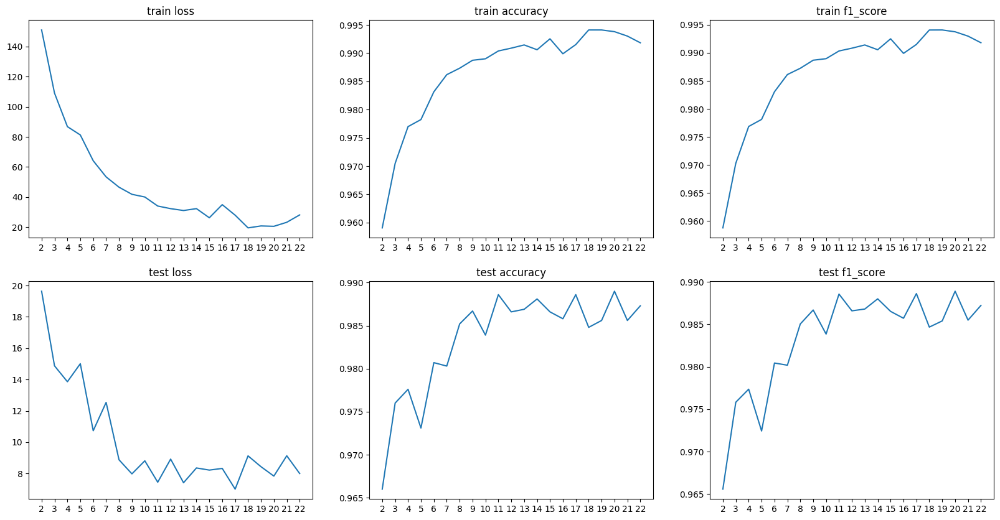

# README не обновлено и не отражает текущую ситуацию

# TODO
* Check if all gradients (partial derivatives) match in torch and numpy implementations
* add loss test funciton
* Check if test_stack_of_layers works

* Update the readme
    * choose readme structure
    * пояснить, что numpy_nn и torch_nn должны рассматриваться как библиотеки
    * пути до файлов с кодом должны быть актуальными
    * translate README to English
    * добавить раздел поясняющий как устроены тесты

* Мб добавить в скрипты проверку, есть ли необходимые модули в sys.path, если нет, сделать добавление

* Убедиться, что блокноты для обучения моделей как pytorch, так и numpy работают
* Когда батч-нормализация будет починена, удалить варианты resnet без батч-нормалищации 

# Реализация ResNet-101, Adam, AbaBound (pytorch vs numpy)

<!-- 
## Задание:
1. Скачайте датасет [CarDatasets](https://drive.google.com/drive/folders/1pkudEBabqbXMxRTgfGQs3e0VqfTjtqWU)
2. Реализуйте ResNet-101 с оптимизатором [Adabound](https://arxiv.org/abs/1902.09843v1) с использованием
Numpy и с **Torch**/Tensorflow/Jax
3. Оцените качество модели на тесте и сравните быстродействие
реализованных вариантов.
4. Запустить обучение на классическом Adam и сравнить сходимость
результатов с вариантом задания.
5. Сделайте отчёт в виде readme на GitHub, там же должен быть выложен
исходный код.
-->

## Теоретическая база
### ResNet-101

<!--
ResNet-101 включает в себя свертку conv1, макс пулинг и далее множество коллекций слоев convi. convi_x является bottleneck'ом. Bottlencek состоит из трех сверток: 1x1, 3x3, 1x1. Первая свертка понижает число выходных каналов, последняя повышает.
Помимо сверток Bottleneck имеет identity mapping (точная копия входа Bottleneck'а), который складывается с выходом последней свертки Bottleneck'а. В случае, когда число каналов identity mapping'a не совападает с числом каналов выхода последней свертки, перед складыванием с conv3 над identity mapping'ом производится свертка 1x1, приводящая его к необходимой размерности.

В conv1 размерность плоскости входного тензора уменьшается вдвое в связи с тем, что stride = 2. Перед conv2_1 производится даунсемплинг карты признаков (feature map) в 2 раза с помощью max pooling'а. Далее conv3_1, conv_4_1 и conv5_1 первая свертка bottleneck'а имеет stride = 2. Таким образом, ширина и высота сходного "изображения" сужаются в 32 раза перед тем как дойти до average pooling, который оставляет одно значение для каждого канала. Такой пулинг позволяет использовать входные данные произвольной размерности. Тем не менее, в связи с понижением размерности при проходе через сеть вход должен быть не менее 32 и, желательно, кратен 32 (иначе тензоры будут "обрезаться").
-->

## Реализация и обучение resnet-101 на numpy
### Описание разработанной системы (алгоритмы, принципы работы, архитектура)
Весь код, связанный с реализацией и обучением resnet-101 на numpy, в директории [./numpy_nn](./numpy_nn).

В модуле [./numpy_nn/models/resnet.py](./numpy_nn/models/resnet.py) реализация resnet-101 на numpy. Там находятся:
* реалиация `Bottleneck` residual block'а
* класс `ResNet`, который собирает архитектуру получая на вход список количеств residual ботлнеков каждой конфигурации 
* Функция `resnet101` вызывающая конструктор класса `ResNet` с количествами ботлнеков: [3, 4, 23, 3]

**Градиенты torch и numpy Bottleneck'ов перестали совпадать после того, как в обе реализации была добавлена батч нормализация.** Выходы совпадают даже у resnet целиком.

Базовые модули сврточной нейронной сети, оптимизаторы и функция потерь реализованы в файле [./numpy_nn/modules/np_nn.py](./numpy_nn/modules/np_nn.py).

В моей реализации оптимизаторы получают на вход список слоёв. Каждый модуль нейронной сети (дочерние классы класса Layer, а также классы реализующие части нейронной сети или нейронную сеть целиком) имеют метод get_trainable_layers, возвращающий все обучаемые слои, входящие в состав модуля.

Реализованы классы:
* FullyConnectedLayer
* Conv2d — реализация свертки с помощью матричного умножения. Подробнее в [./numpy_nn/modules/README.md](./numpy_nn/modules/README.md).
* Conv2dWithLoops — имплементация свертки на циклах.
* MaxPool2d
* Flatten
* ReLULayer
* SigmoidLayer
* CrossEntropyLossWithSoftMax
* AdamOptimizer
* GradientDescentOptimizer
* Sequential
* BatchNormalization2d

В [./numpy_nn/test/module_tests.ipynb](./numpy_nn/test/module_tests.ipynb) производится проверка классов, реализованных на numpy путём сравнения результатов с аналогичными классами на pytorch. Для этого две реализации инициализируются одинаковыми весами (если речь об обучаемом модуле нейронной сети), в качетве входны данных и градиента по выходу генерируются тезоры случайных чисел. Сравниваются выходы, а также градиенты по весам, смещениям (bias) и входным данным. **В частности, было проверено, что resnet101, реализованный на numpy и на torch при одинаковых весах, входных данных и градиентах по выходным данным возвращают одинаковые выходные данные и одинаковые градиенты по входным данным**.

В [./numpy_resnet_mnist.ipynb](./numpy_resnet_mnist.ipynb) произведено обучение на датасете MNIST моей реализации resnet-101 на numpy. Результаты обучения resnet на numpy на графике ниже. Также в этом файле определяется и обучается небольшая сверточная нейронная сеть, чтобы продемонстрировать, как пользоваться реализованными класами.

Реализация свертки, основанной на матричном умножении, ускорило обучение resnet101 на MNIST более чем в 34 раза! На изоборажении ниже видно, что ранее одна эпоха треборвала более 114 часов, теперь около 3 часов. Ниже подтверждающий скриншот.

## Реализация resnet-101 на torch и сравнение обучения с использованием Adam и AdaBound
### Описание разработанной системы (алгоритмы, принципы работы, архитектура)
Весь код находится в директории [./pytorch_nn](./pytorch_nn).

В [./pytorch_nn/models/resnet.py](./pytorch_nn/models/resnet.py) Находится моя имплементация resnet на pytorch. Классы аналогичны описанным выше для numpy.

В [./resnet-adam-vs-adabound.ipynb](./resnet-adam-vs-adabound.ipynb) сравнивается обучение на датасете [Stanford Cars](http://ai.stanford.edu/~jkrause/cars/car_dataset.html) моей и оффициальной имплементаций resnet101 с оптимизаторами Adam и AdaBound.

Чтобы сравнение было честным и воспроизводимым перед обучением моей имплементации модели инициализировались одинаковыми весами. К сожалению, аналогичного действия по отношению к официальной имплементации не было произведено.

Из исходных изображений оставляется только участок, содержащий машину. Затем производится преобразование к одноканальному изображению в оттенках серого и сжатие до 96x96. 

### Результаты работы и тестирования системы (скриншоты, изображения, графики, закономерности)

*Все графики обучкения более гладцие, так как валидация производилась в 4 раза реже обучения*

Ниже результаты обучения моей имплементации resnet101 на torch c Adam (синий) и с AdaBound (оранжевый) learning rate = 0.005.

Ниже отдельно результаты обучения моей имплементации resnet101 на torch c  AdaBound.

Ниже результаты обучения оффициальной имплементации resnet101 на torch c Adam (синий) и с AdaBound (оранжевый) learning rate = 0.001.

Ниже результаты обучения моей имплементации resnet101 *до того, как была добавлена батч-нормализация* на torch c Adam (синий) и с AdaBound (оранжевый) learning rate = 0.002.

### Выводы по работе

Очевидно, работать с моделями, используя фреймворки удобнее, так как они высокооптимизированы и поддерживают cuda.

Исползование реализации свертки в виде матричного умножения делает скорость обратного распространения значительно быстрее продемонстрировано в конце [./numpy_nn/test/module_tests.ipynb](./numpy_nn/test/module_tests.ipynb). Например, при параметрах n_input_channels = 4,n_output_channels = 2, width = 3, height = 5, kernel_size = 3, stride = 1, padding = 3 и batchsize = 8 1000 итераций обратного распространения на pytorch занимают 1.2 секунды, при матричной имлементации свертки - 4.2 секунды, а на циклах - 20.7 секунды.

Изначально моя имплементцаия resnet-101 не содержала батч-нормализацию. Ее использование ускорило обучение 

При обучении моей имплементации c Adabound функция потерь падает невероятно медленно и по сравненю с Adam выглядит как прямая линия.

Обучение официально имлементации resnet101 тоже было медленне с AdaBound.

В данном эксперименте не было выявлено заявленных преимуществ AdaBound.

<!--
## To do:

* Добавить нормализацию изображений Stanford Cars датасета
* Так как машины не квадратные, возможно, лучше приводить к размеру 64x96
* Переписать [./numpy_CNN/NumpyNN/NN_np](./numpy_CNN/NumpyNN/NN_np.py), чтобы оптимизаторы принимали параметры, а не обучаемые слои. (Уже ведется работа в отдельном branch'е)
* Сделать методы сохранения параметров модели (или обучаемых слоев модели) в файл и загрузки из файла. Как минимум потому что обучаемые слои хранят входные данные => Если делать pickle модели целиком, записывется много бесполезной информации 
* Сделать вариант forward и backward Conv2d, где forward не сохраняет преобразованные input, а backward применяет преобразование к исходному input. Будет работать немного медленнее, но сильно сэкономит память
* Добавить Average pooling и reshape в resnet на numpy. Сейчас их нет и resnet на numpy умеет работать только с изображениями 32x32.
-->
## Использованные источники
1. [Adabound](https://arxiv.org/abs/1902.09843v1)
2. [Adam](https://arxiv.org/abs/1412.6980)
3. [ResNet](https://arxiv.org/pdf/1512.03385.pdf)

