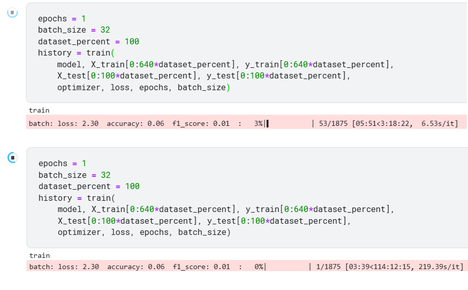

# ResNet-101 numpy

ResNet-101 на numpy без других библиотек и апробация на MNIST

Также была реализована ResNet-101 на torch для тестирования numpy реализации.

## Содержимое корня репозитория
* [numpy_resnet_mnist.ipynb](./numpy_resnet_mnist.ipynb) - обучение [numpy реализации](./numpy_nn/models/resnet.py) resnet-101 на датасете MNIST с использованием оптимизатора Adam
* Python packages, имплементиррованные в рамках проекта:
    * [numpy_nn](./numpy_nn) - реализация с использованием только numpy resnet101, всех слоев, необходимых для создания данной модели, а также оптимизаторов (SGD, Adam) и CE Loss. Тестиорваие всего перечисленного
    * [pytorch_nn](./pytorch_nn) - реализация resnet101 на pytorch
* Другое:
    * [utils](./utils) - python модули, полезные в jupyter блокноте проекта. Например, вывод графиков с историей обучения

Директории [numpy_nn](./numpy_nn) и [pytorch_nn](./pytorch_nn) следует воспринимать как библиотеки, внутри которых нет исполняемого кода


## Теоретическая база
### ResNet-101


### Adam


<!--
ResNet-101 включает в себя свертку conv1, макс пулинг и далее множество коллекций слоев convi. convi_x является bottleneck'ом. Bottlencek состоит из трех сверток: 1x1, 3x3, 1x1. Первая свертка понижает число выходных каналов, последняя повышает.
Помимо сверток Bottleneck имеет identity mapping (точная копия входа Bottleneck'а), который складывается с выходом последней свертки Bottleneck'а. В случае, когда число каналов identity mapping'a не совападает с числом каналов выхода последней свертки, перед складыванием с conv3 над identity mapping'ом производится свертка 1x1, приводящая его к необходимой размерности.

В conv1 размерность плоскости входного тензора уменьшается вдвое в связи с тем, что stride = 2. Перед conv2_1 производится даунсемплинг карты признаков (feature map) в 2 раза с помощью max pooling'а. Далее conv3_1, conv_4_1 и conv5_1 первая свертка bottleneck'а имеет stride = 2. Таким образом, ширина и высота сходного "изображения" сужаются в 32 раза перед тем как дойти до average pooling, который оставляет одно значение для каждого канала. Такой пулинг позволяет использовать входные данные произвольной размерности. Тем не менее, в связи с понижением размерности при проходе через сеть вход должен быть не менее 32 и, желательно, кратен 32 (иначе тензоры будут "обрезаться").
-->

## Реализация resnet-101 на numpy (содержимое numpy_nn) и обучение 

### Базовые слои
Базовые модули сврточной нейронной сети, оптимизаторы и функция потерь реализованы в директории [./numpy_nn/modules](./numpy_nn/modules).

Реализованы классы:
* FullyConnectedLayer
* Conv2d — реализация свертки с помощью матричного умножения. Подробнее в [./numpy_nn/modules/README.md](./numpy_nn/modules/README.md).
* Conv2dWithLoops — имплементация свертки на циклах.
* MaxPool2d
* Flatten
* ReLULayer
* SigmoidLayer
* CrossEntropyLossWithSoftMax
* AdamOptimizer
* GradientDescentOptimizer
* Sequential
* GlobalAveragePooling2D
* BatchNormalization2d


Реализация свертки, основанной на матричном умножении, привела к **более чем 34-ех кратному ускорению обучения** resnet101 на MNIST! На скриншоте ниже видно, что ранее одна эпоха треборвала более 114 часов, теперь около 3 часов.




В моей реализации оптимизаторы получают на вход список слоёв. Это необходимо, потому что на данный момент, чтобы получить актуальные частные производные функции потрерь по параметрам, нужно их запросить у слоя, так как они изменяются не inplace. Каждый модуль нейронной сети (дочерние классы класса Layer, а также классы реализующие части нейронной сети или нейронную сеть целиком) имеют метод get_trainable_layers, возвращающий все обучаемые слои, входящие в состав модуля. Выход данного метода подется на вход конструктору оптимизатора. В ветке [optimizers_take_parameters](https://github.com/proshian/DNN_course_ITMO_2022/tree/optimizers_take_parameters) ведется работа, чтобы оптимизаторы принимали параметры, а слои были переписаны так, чтобы частные производные всегда были одними и теми же numpy матрицами, которые меняются inplace.


### ResNet-101 
В модуле [numpy_nn/models/resnet.py](./numpy_nn/models/resnet.py) реализация resnet-101 на numpy. Там находятся:
* реалиация `Bottleneck` residual block'а
* класс `ResNet`, который собирает архитектуру получая на вход список количеств residual ботлнеков каждой конфигурации 
* Функция `resnet101` вызывающая конструктор класса `ResNet` с количествами ботлнеков: [3, 4, 23, 3]

<!-- Также в директории [numpy_nn/models](./numpy_nn/models/) присутствует реализация [resnet101 без батч-нормализации](./numpy_nn/models/resnet_without_batchnorm.py) -->


### Тестирование
Директория [numpy_nn/test](./numpy_nn/test/) посвящена тестированию классов, реализующих модули нейронной сети на numpy.

Для тестирования используются аналогичные классы на pytorch. Если тестируется обучаемый модуль, обе реализации инициализируются одинаковыми весами. В качетве входных данных и частной производной функции потерь по выходу модуля генерируются тезоры случайных чисел. Производится forward и backward проходы и Сравниваются выходы, а также частные производные функции потерь по весам, смещениям (bias) и входным данным.

Таким образом, псевдокод теста выглядит так:
```python
MY_MODULE.init_weights_with(TORCH_MODULE)

input_ = np.random.rand(INPUT_SHAPE)

input_torch = torch.from_numpy(input_).float()
input_torch.requires_grad = True

d_J_d_out = np.random.rand(OUTPUT_SHAPE)

out = MY_MODULE.forward(input_)
torch_out = TORCH_MODULE(input_torch)

d_J_d_in = MY_MODULE.backward(d_J_d_out)
torch_out.backward(torch.tensor(d_J_d_out), retain_graph=True)

print("out all close:", np.allclose(out, torch_out.detach().numpy()))
print("d_J_d_in all close:", np.allclose(d_J_d_in, input_torch.grad.detach().numpy()))
```

Тестирование производится с помощью библиотеки unittest. Все классы, тестирующие какие-либо модули нейронной сети являются наследниками класса TestLayer, определенного python модуле [test_layer.py](./numpy_nn/test/test_layer.py). Алгоритм, описанный выше реализован в методе _test_module, класса TestLayer. Тесты большинства модулей нейронной сети реализованы в виде отдельных скриптов в директории [test](./numpy_nn/test), однако некоторые тесты временно находятся в jupyter notebook'е [module_tests.ipynb](./numpy_nn/test/module_tests.ipynb). Тесты из jupyter notebook'а не заействуют unittest. Они будут переписаны и перенесены в отдельные скрипты.

Если тестирование проходит успешно, то в консоль выводится сообщение "OK". В противном случае выводится сообщение об ошибке и в директории [test/failed_tests_dumps](./numpy_nn/test/failed_tests_dumps) сохраняется pickle файл. Этот файл хранит словарь с ключами 'my_module', 'torch_module', 'input_np', 'dJ_dout', позволяющими воспроизвести тест, на котором произошла ошибка.

При каждом pull-request'е в ветку main запускается `compare_with_pytorch` workflow, который запускает все тесты и производит coverage report.

Все базовые модули нейронной сети, кроме батчевой нормализации, имеют результаты (под результатами понимаются чатные производные результата работы слоя по всем параметрам и выходным данным), совпадающие с pytorch до 6 знаков после запятой. Результаты батчевой нормализации свпадают до 4 знаков после запятой.

Выходные данные и частная производня функции потерь по входным данным resnet101 совпадают с аналогом на pytorch до 6 знаков после запятой.

### Обучение
В [./numpy_resnet_mnist.ipynb](./numpy_resnet_mnist.ipynb) произведено обучение на датасете MNIST моей реализации resnet-101 на numpy. Также в этом файле предоставлен код для определения и обучения небольшой сверточной нейронной сети, чтобы продемонстрировать, как пользоваться реализованными класами.

Результаты обучения resnet на numpy на графикe ниже.


### Обученная модель
В [./numpy_resnet_mnist.ipynb](./numpy_resnet_mnist.ipynb) после каждой эпохи обучения формируется словарь model_optimizer_history:
* 'model': модель в состоянии
* 'optimizer': оптимизатор в состоянии
* 'epoch_history': история обучения - словарь с ключами, соответствующими фазе обучения (в данном случае 'train' и 'test'), и значениями - словарями, отражающими историю фазы. Эти вложенные словари имеют названия метрик в качестве ключей и списки со значениями метрик на каждой эпохе в качестве значений.
* 'model_info': словарь с информацией о модели и о гиперпараметрах обучения (например, использованном батчсайзе) 

Словарь model_optimizer_history сохраняется в файл `./numpy_nn/models/trained_models/resnet101/model_optimizer_history_dict.pickle`. Благодаря этому словарю можно продолжить обучение с эпохи, на которой оно было прервано, вывести график с историей обучения. 

В github репозитории файл `model_optimizer_history_dict.pickle` отсутствует. Он версионируется с помощью DVC и хранится в удаленном хранилище. Чтобы получить версию файла `model_optimizer_history_dict.pickle`, актуальную для версии репозитория, в которой мы находимся,  необходимо в командной строке перейти в репозиторий и выполнить комманду `dvc pull`. После этого файл `model_optimizer_history_dict.pickle` появится в директории `./numpy_nn/models/trained_models/resnet101/`. При этом это будет актуальный словарь: если запустить обучение в `numpy_resnet_mnist.ipynb`, будет получен идентичный словарь с такими же значениями, такими же ключами, такой же структурой, такими же весами нейронной сети и таким же состоянием оптимизатора.

Нужно отметить, что есть две причины, по которым оптимизатор и модель сохраняются в одной структуре
1. Инкапсуляция: так не возникает вопроса какой файл оптимизатора относится к какому файлу модели
2. Если сохранять отдельно, нарушаются связи между параметрами модели и оптимизатором. Если быть точнее, между слоями нейронной сети и оптимизатором, потому что в данной имплементации оптимизатор запрашивает актуальные параметры у слоя (потому что мне сходу не пришло в голову, что я могу передавать параметры оптимизатору "по ссылке" если создам класс параметров). То есть и в оптимизаторе и в модели хранились бы идентичные слои, но являющиеся различными объектами. Решенем проблемы было бы выполнение  `optimizer.trainable_layers = model.trainable_layer` после загрузки оптимизатора и модели.
3. В связи с тем, что парметры нужно хранить и в модели и в оптимизаторе, раздельное сохранение затрачивало бы больше памяти


## Реализация resnet-101 на torch
<!-- Весь код находится в директории [./pytorch_nn](./pytorch_nn). -->

В [./pytorch_nn/models/resnet.py](./pytorch_nn/models/resnet.py) Находится моя имплементация resnet на pytorch. Классы аналогичны описанным выше для numpy.


## Выводы по работе
Очевидно, работать с моделями, используя фреймворки удобнее, так как они высокооптимизированы и поддерживают cuda.

Исползование реализации свертки в виде матричного умножения делает скорость обратного распространения значительно быстрее продемонстрировано в конце [./numpy_nn/test/module_tests.ipynb](./numpy_nn/test/module_tests.ipynb). Например, при параметрах n_input_channels = 4,n_output_channels = 2, width = 3, height = 5, kernel_size = 3, stride = 1, padding = 3 и batchsize = 8 1000 итераций обратного распространения на pytorch занимают 1.2 секунды, при матричной имлементации свертки - 4.2 секунды, а на циклах - 20.7 секунды.

<!-- Изначально моя имплементцаия resnet-101 не содержала батч-нормализацию. Ее использование ускорило обучение  -->

<!-- При обучении моей имплементации c Adabound функция потерь падает невероятно медленно и по сравненю с Adam выглядит как прямая линия. -->

<!-- Обучение официально имлементации resnet101 тоже было медленне с AdaBound. -->

<!-- В данном эксперименте не было выявлено заявленных преимуществ AdaBound. -->

## Использованные источники
1. [Adam](https://arxiv.org/abs/1412.6980)
2. [ResNet](https://arxiv.org/pdf/1512.03385.pdf)


# TODO

* Получить батчнормализацию, которая будет проходить тесты с точностью 1e-6

* add loss test funciton
* Check if test_stack_of_layers works

* Update the readme
    * translate README to English
    * добавить раздел поясняющий как устроены тесты

* Мб добавить в скрипты проверку, есть ли необходимые модули в sys.path, если нет, сделать добавление

* Когда батч-нормализация будет починена, удалить варианты resnet без батч-нормалищации 


Второстепенные todo задачи:

<!-- * Добавить нормализацию изображений Stanford Cars датасета
* Так как машины не квадратные, возможно, лучше приводить к размеру 64x96 -->
* Переписать [./numpy_CNN/NumpyNN/NN_np](./numpy_CNN/NumpyNN/NN_np.py), чтобы оптимизаторы принимали параметры, а не обучаемые слои. (Уже ведется работа в отдельном branch'е)
* Сделать методы сохранения параметров модели (или обучаемых слоев модели) в файл и загрузки из файла. Как минимум потому что обучаемые слои хранят входные данные => Если делать pickle модели целиком, записывется много бесполезной информации 
* Сделать вариант forward и backward Conv2d, где forward не сохраняет преобразованные input, а backward применяет преобразование к исходному input. Будет работать немного медленнее, но сильно сэкономит память
* Можно обобщить batchnorm (чтобы работал для любой размерности). Например, сделать backward как тут: https://github.com/ddbourgin/numpy-ml/blob/master/numpy_ml/neural_nets/layers/layers.py#L969-L1215


В ветке `adabound-and-batchnorm` ведется работа по добавлению в resnet батчевой нормализации, а также эксперименты по сравнению Adam и Adabound