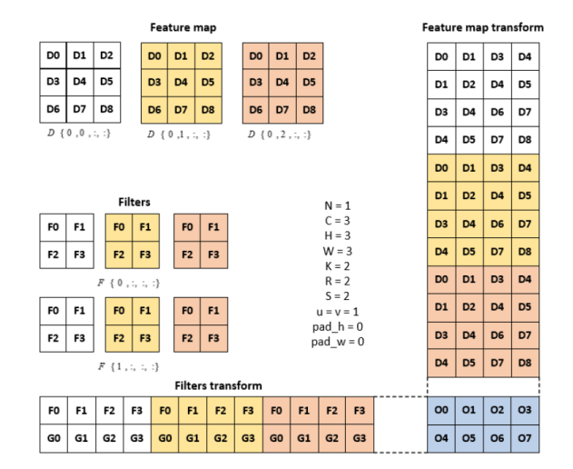

# Пояснение работы свертки:
На 10.01 есть два похожих класса, реализующие свёрточный слой нейронной сети:
* `Conv2dWithLoops`. От `Conv2d` его отличают только методы `forward` и `bacward`. Оставил этот класс, как найивную имплементацию, которую легче читать.
* `Conv2d`
    * `forward` реализован как матричное произведение преобразованых весов и преобразованого входного тензора. Преобразование описано на изображении ниже. Каждая строка преобразованых весов является выпрямленным фильтром. Каждый столбец преобразованого входного тензора является выпрямленным рецептивным полем (receptive field) фильтра, скользящего по исходному входному тензору. 
    * `backward` на данный момент вычисляет градиент по весам как матричное произведение. Аналогичен backward'у полносвязного слоя. После матричного произведения input_gradient = converted_weights.T @ output_gradient_converted необходимо "собрать" из двумерной матрицы четырехмерный тензор. Эта операция является преобразованию, описанному ранее, но все пересечения суммируются'

<i>Свертка как произведение матриц.</i>

Источник изображения: https://www.researchgate.net/figure/Representing-convolution-operation-as-matrix-multiplication_fig1_317967088

